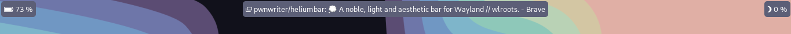

<h4 align="center"><strong><code>He 1s2 💭 </code></strong> — A noble, light and aesthetic bar for <code>Wayland // wlroots</code> </h4>

 

## WIP

Copyright &copy; 2023<a href="https://pwnwriter.xyz" target="_blank"> pwnwriter xyz ☘️ </a> 
  
